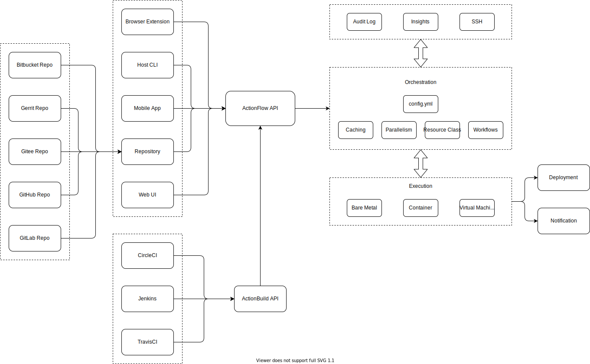

# actionview

[](https://hub.docker.com/r/craftslab/actionview)
[](https://github.com/craftslab/actionview/blob/master/LICENSE)
[](https://github.com/craftslab/actionview/tags)


## Introduction

*Action View* is a pipeline action view written in JavaScript.

See *[Action FLow](https://github.com/craftslab/actionflow/)* as a server of *Action View*.


## Requirement

- Node.js >= 12.19.0
- Vue.js >= 2.6.12


## Running

```bash
git clone https://github.com/craftslab/actionview.git

cd actionview
npm install
npm run lint
npm run build

npm run serve
```


### Docker

```
git clone https://github.com/craftslab/actionview.git

cd actionview
docker build --no-cache -f Dockerfile -t craftslab/actionview:latest .
docker run -d -p 9091:80 craftslab/actionview:latest
```


## Design




## Reference

- [Material Icon](https://material.io/resources/icons/?icon=call_merge&style=baseline)


## License

Project License can be found [here](LICENSE).
